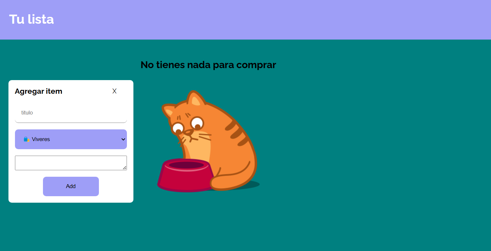

# README

## Descripción

Este proyecto es una aplicación web de gestión de listas de compras. Permite a los usuarios agregar elementos a una lista, ver detalles de cada elemento, marcar elementos como completados y eliminarlos. La interfaz es interactiva y utiliza el DOM para manipular elementos de manera dinámica.

## Estructura del Código

El código está escrito en JavaScript y se centra en la manipulación del DOM. A continuación, se detalla la estructura y funcionalidad de las principales secciones del código.

## Vista de la página


### Link de la aplicación
https://todo-list-vanillajs.vercel.app/

### Variables Globales

```javascript
const d = document;

const $add = d.querySelector(".add"),
$fondo = d.querySelector(".hero"),
$popup = d.querySelector(".popup"),
$close = d.querySelectorAll(".close"),
$agregarItem = d.querySelector(".add-todo");
const $ul = d.createElement("ul");
const $default = d.querySelectorAll(".default");
const form = d.querySelector("form");
const $more = d.querySelector(".more");
const $details = d.getElementById("details");
const $lis = d.querySelectorAll("li");
const $completed = d.querySelector(".completed");
$add: Elemento del botón que abre el popup para agregar un nuevo elemento.
$popup: Sección que contiene el formulario para agregar un nuevo elemento.
$close: Botones para cerrar el popup y otros diálogos.
$ul: Lista dinámica que contendrá los elementos agregados.
$completed: Sección que muestra las tareas completadas.

